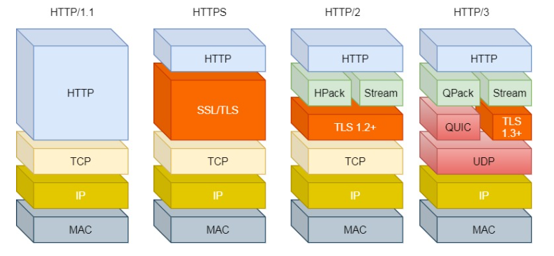

# HTTP 协议演变：从 1.1 到 3.0

## 1. HTTP/1.1 相比 HTTP/1.0 的性能改进

### 1.1 主要改进
- **长连接**：使用长连接的方式改善了 HTTP/1.0 短连接造成的性能开销
- **管道化传输**：支持管道（pipeline）网络传输，只要第一个请求发出去了，不必等其回来就可以发第二个请求出去，可以减少整体的响应时间

### 1.2 缺点
- **冗长的首部**：每次互相发送相同的首部造成的浪费较多
- **队头阻塞**：服务器是按请求的顺序响应的，如果服务器响应慢，会招致客户端一直请求不到数据
- **无优先级控制**：没有请求优先级控制

## 2. HTTP/2 的优化

### 2.1 主要改进

#### 2.1.1 头部压缩
HTTP/2 会压缩头（Header）。如果你同时发出多个请求，他们的头是一样的或是相似的，那么，协议会帮你消除重复的部分。

#### 2.1.2 二进制格式
收到报文后，无需再将明文的报文转成二进制，而是直接解析二进制报文，这增加了数据传输的效率。

#### 2.1.3 多路并用
- HTTP/1.1 队头阻塞的问题，HTTP/2 引出了 **Stream** 概念
- 多个 Stream 复用在一条 TCP 连接
- 不同的 HTTP 请求用独一无二的 Stream ID 来区分
- 接收端可以通过 Stream ID 有序组装成 HTTP 消息
- 不同 Stream 的帧是可以乱序发送的，因此可以并发不同的 Stream

#### 2.1.4 服务器主动推送资源
- 客户端和服务器双方都可以建立 Stream
- 客户端建立的 Stream 必须是奇数
- 服务器建立的 Stream 必须是偶数号

### 2.2 缺陷

#### 2.2.1 队头阻塞问题
HTTP/2 还是存在"队头阻塞"的问题，问题不是在 HTTP 这一层面，而是在 **TCP 这一层**：

- 一旦发生丢包，就会阻塞住所有的 HTTP 请求
- HTTP/2 是基于 TCP 协议来传输数据的，TCP 是字节流协议
- TCP 层必须保证收到的字节数据是完整且连续的，这样内核才会将缓冲区里的数据返回给 HTTP 应用
- 当「前 1 个字节数据」没有到达时，后收到的字节数据只能存放在内核缓冲区里
- 只有等到这 1 个字节数据到达时，HTTP/2 应用层才能从内核中拿到数据

## 3. HTTP/3 的改进

### 3.1 核心变化
HTTP/3 把 HTTP 下层的 TCP 协议改成了 **QUIC**。

### 3.2 QUIC 协议特性
- **基于 UDP**：UDP 是不可靠传输的，但基于 UDP 的 QUIC 协议可以实现类似 TCP 的可靠性传输
- **可靠性保证**：QUIC 有自己的一套机制可以保证传输的可靠性
- **无队头阻塞**：当某个流发生丢包时，只会阻塞这个流，其他流不会受到影响，因此不存在队头阻塞问题

### 3.3 技术优势
- **独立流处理**：每个流独立处理，互不影响
- **快速重传**：基于 UDP 的快速重传机制
- **连接迁移**：支持网络切换时保持连接
- **0-RTT 重连**：减少重连延迟

## 4. 版本对比总结

| 特性 | HTTP/1.1 | HTTP/2 | HTTP/3 |
|------|----------|--------|--------|
| 传输协议 | TCP | TCP | UDP (QUIC) |
| 多路复用 | 有限（管道化） | 完全支持 | 完全支持 |
| 头部压缩 | 无 | HPACK | QPACK |
| 服务器推送 | 无 | 支持 | 支持 |
| 队头阻塞 | 有 | 有（TCP 层） | 无 |
| 连接建立 | 慢 | 中等 | 快 |

## 5. 实际应用建议

### 5.1 升级策略
1. **确保 HTTPS**：为 HTTP/2 做准备
2. **优化资源**：合并、压缩、缓存
3. **启用 HTTP/2**：在支持的环境中启用
4. **考虑 HTTP/3**：在稳定后考虑升级

### 5.2 性能监控
- **WebPageTest**：测试不同协议的性能
- **Chrome DevTools**：查看协议版本
- **服务器日志**：监控协议使用情况

### 5.3 最佳实践
- **资源优化**：减少请求数量
- **缓存策略**：合理设置缓存
- **CDN 使用**：利用 CDN 的协议支持
- **监控分析**：持续监控性能指标