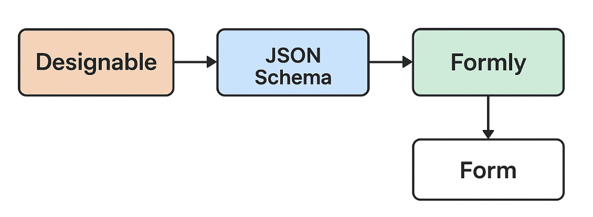

“我们在 sayloai 项目里自研了一套基于 Formly + Designable 思路的运营可视化搭建系统，
从左侧拖入表单控件组成表单，中间可以预览，选中预览的控件在右侧面板填写两个必填的字段：字段标识和标题。
字段标识就是开发者消费这个字段用到的 key，就是对象中的 key。
标题就是运营同学识别这个字段的标题。
上面四个 Tab 依次切换 表单编辑态预览，Schema 预览，表单生成后的数据预览，表单预览。

# 可视化表单搭建系统

参考学习：
https://www.yuque.com/xjchenhao/development/wd0vsg#u0pku
组件属性可配置主要依赖 json Schema 描述，属性配置就是要实现一个 jsonSchema 规范的可视化面板，较复杂的功能点是对数组、对象类型的递归。

## 1. 系统总览

基于 **Formly** 与 **Designable** 思想的运营可视化表单搭建系统，通过拖拽生成页面，实时预览并生成 Schema 驱动的表单，运营可独立配置与发布活动。

### 核心价值

- **降低开发成本**：运营人员可独立搭建表单页面，无需开发介入
- **提升配置效率**：可视化拖拽 + 实时预览，所见即所得
- **统一表单规范**：基于 JSON Schema 标准，保证数据结构一致性
- **灵活扩展性**：组件化设计，支持自定义业务组件

## 2. 技术架构

### 系统架构图



## 3. Formly 核心技术 - Schema 驱动表单

### 动态表单渲染

```typescript
// 函数式组件渲染
const renderFormField = (
  schema: FieldSchema,
  value: any,
  onChange: Function
) => {
  const fieldProps = {
    value,
    onChange,
    ...extractWidgetProps(schema),
  };

  return match(schema.widget)({
    input: () => <InputWidget {...fieldProps} />,
    select: () => <SelectWidget {...fieldProps} />,
    checkbox: () => <CheckboxWidget {...fieldProps} />,
    upload: () => <UploadWidget {...fieldProps} />,
    custom: () => <CustomWidget {...fieldProps} schema={schema} />,
  });
};

// 表单状态管理
const useFormState = (schema: FormSchema) => {
  const [values, setValues] = useState({});
  const [errors, setErrors] = useState({});

  const updateField = useCallback(
    (path: string, value: any) => {
      setValues((prev) => setDeepValue(prev, path, value));
      validateField(path, value, schema);
    },
    [schema]
  );

  return { values, errors, updateField };
};
```

## 4. Designable 实现 - 可视化设计器

### 拖拽设计器核心

```typescript
// 设计器状态管理
interface DesignState {
  components: ComponentNode[]; // 组件树
  selectedId: string | null; // 选中组件
  dragState: DragState; // 拖拽状态
  previewMode: boolean; // 预览模式
}

// 函数式组件树操作
const addComponent = (
  tree: ComponentNode[],
  targetId: string,
  component: ComponentNode
) =>
  tree.map((node) =>
    node.id === targetId
      ? { ...node, children: [...node.children, component] }
      : { ...node, children: addComponent(node.children, targetId, component) }
  );

const updateComponent = (
  tree: ComponentNode[],
  id: string,
  updates: Partial<ComponentNode>
) =>
  tree.map((node) =>
    node.id === id
      ? { ...node, ...updates }
      : { ...node, children: updateComponent(node.children, id, updates) }
  );
```

### 组件属性配置面板

```typescript
// 递归处理复杂属性
const PropertyField = ({ name, schema, value, onChange }) => {
  if (schema.type === "object") {
    return (
      <ObjectPropertyField schema={schema} value={value} onChange={onChange} />
    );
  }

  if (schema.type === "array") {
    return (
      <ArrayPropertyField schema={schema} value={value} onChange={onChange} />
    );
  }

  return (
    <SimplePropertyField schema={schema} value={value} onChange={onChange} />
  );
};
```

## 5. 运营配置与发布流程

### 运营工作流

```typescript
// 函数式工作流定义
const operationWorkflow = pipe(
  createProject, // 1. 创建项目
  designForm, // 2. 拖拽设计表单
  configProperties, // 3. 配置组件属性
  previewAndTest, // 4. 预览测试
  generateSchema, // 5. 生成 Schema
  publishActivity // 6. 发布活动
);

// 发布配置
interface PublishConfig {
  activityId: string;
  formSchema: FormSchema;
  publishTime: Date;
  expireTime: Date;
  targetAudience: string[];
  abTestConfig?: ABTestConfig;
}

const publishActivity = async (config: PublishConfig) => {
  const validatedSchema = validateFormSchema(config.formSchema);
  const publishResult = await deployToProduction({
    ...config,
    formSchema: validatedSchema,
  });

  return publishResult;
};
```

### 实时预览机制

```typescript
// 设计态到运行态的转换
const designToRuntimeTransform = (designState: DesignState): FormSchema => {
  return pipe(
    designState.components,
    convertComponentsToSchema,
    addValidationRules,
    optimizeSchema
  );
};

// 实时预览组件
const PreviewRenderer = ({ designState }: { designState: DesignState }) => {
  const runtimeSchema = useMemo(
    () => designToRuntimeTransform(designState),
    [designState]
  );

  return <FormRenderer schema={runtimeSchema} onSubmit={handlePreviewSubmit} />;
};
```

## 6. 核心技术难点与解决方案

### 1. 递归组件属性配置

```typescript
// 处理嵌套对象和数组的递归渲染
const renderPropertyRecursively = (schema: any, path: string[], value: any) => {
  if (schema.type === "object") {
    return Object.entries(schema.properties).map(([key, subSchema]) =>
      renderPropertyRecursively(subSchema, [...path, key], value?.[key])
    );
  }

  if (schema.type === "array") {
    return (value || []).map((item: any, index: number) =>
      renderPropertyRecursively(schema.items, [...path, index], item)
    );
  }

  return <PropertyInput schema={schema} path={path} value={value} />;
};
```

### 2. Schema 与 UI 的双向绑定

```typescript
// Schema 变更驱动 UI 更新
const useSchemaBinding = (initialSchema: FormSchema) => {
  const [schema, setSchema] = useState(initialSchema);
  const [uiState, setUIState] = useState(() => schemaToUIState(initialSchema));

  const updateSchema = useCallback(
    (updater: (schema: FormSchema) => FormSchema) => {
      setSchema((prevSchema) => {
        const newSchema = updater(prevSchema);
        setUIState(schemaToUIState(newSchema));
        return newSchema;
      });
    },
    []
  );

  return { schema, uiState, updateSchema };
};
```

### 3. 深拷贝与浅拷贝应用

```typescript
// 组件复制时需要深拷贝
const duplicateComponent = (component: ComponentNode) => {
  // 深拷贝避免引用污染
  const cloned = deepClone(component);
  cloned.id = generateNewId();

  // 递归处理子组件
  if (cloned.children) {
    cloned.children = cloned.children.map((child) => duplicateComponent(child));
  }

  return cloned;
};

// Schema 更新时的浅拷贝优化
const updateComponentProperty = (
  tree: ComponentNode[],
  id: string,
  property: string,
  value: any
) => {
  return tree.map((node) => {
    if (node.id === id) {
      // 浅拷贝节点，深拷贝props
      return {
        ...node, // 浅拷贝节点
        props: {
          ...node.props, // 浅拷贝props
          [property]: value, // 更新特定属性
        },
      };
    }

    // 递归处理子节点
    if (node.children?.length > 0) {
      return {
        ...node,
        children: updateComponentProperty(node.children, id, property, value),
      };
    }

    return node; // 无变化直接返回原对象（性能优化）
  });
};

// 历史记录需要深拷贝快照
const useHistoryManager = () => {
  const [history, setHistory] = useState([]);
  const [currentIndex, setCurrentIndex] = useState(-1);

  const saveSnapshot = useCallback(
    (state: DesignState) => {
      // 深拷贝保存快照，避免后续修改影响历史记录
      const snapshot = deepClone(state);

      setHistory((prev) => [...prev.slice(0, currentIndex + 1), snapshot]);
      setCurrentIndex((prev) => prev + 1);
    },
    [currentIndex]
  );

  const undo = useCallback(() => {
    if (currentIndex > 0) {
      setCurrentIndex((prev) => prev - 1);
      return deepClone(history[currentIndex - 1]); // 返回深拷贝
    }
  }, [history, currentIndex]);

  return { saveSnapshot, undo };
};

// 表单数据处理的拷贝策略
const useFormDataManager = () => {
  // 表单值更新：浅拷贝优化
  const updateFormValue = (path: string, value: any) => {
    setFormData((prev) => ({
      ...prev, // 浅拷贝根对象
      [path]: value, // 直接更新值
    }));
  };

  // 复杂嵌套对象更新：深拷贝确保安全
  const updateNestedValue = (path: string[], value: any) => {
    setFormData((prev) => {
      const newData = deepClone(prev); // 深拷贝避免引用问题
      setDeepValue(newData, path, value);
      return newData;
    });
  };

  return { updateFormValue, updateNestedValue };
};
```

### 4. 性能优化策略

- **虚拟滚动**：大量组件时使用虚拟列表渲染
- **增量更新**：只重新渲染变更的组件
- **Schema 缓存**：复杂 Schema 计算结果缓存
- **懒加载组件**：按需加载自定义组件
- **智能拷贝**：根据场景选择深拷贝/浅拷贝策略
